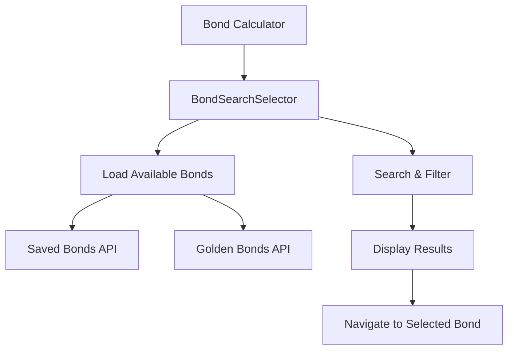

# Bond Selector Implementation Demo

## ✅ Implementation Complete

I've successfully implemented a bond selector that replaces the static title in the bond calculator with an interactive search interface.

## 🎯 Features Implemented

### 1. **Search-Based Selection** (Not Just Dropdown)
- Intelligent search with auto-complete functionality
- Search by issuer name, coupon rate, maturity year, or bond category
- Real-time filtering as you type
- Keyboard navigation (Arrow keys, Enter, Escape)

### 2. **Professional User Experience**
- **Search Input**: Type to find bonds quickly
- **Visual Categories**: Color-coded icons for bond types:
  - 🌟 **Golden Bonds** (Yellow star) - Reference templates
  - 👤 **User Created** (Blue user icon) - Your saved bonds  
  - 📄 **Imported** (Purple file icon) - External bonds
- **Current Bond Highlight**: Shows which bond is currently selected
- **Quick Info Bar**: Displays issuer, coupon rate, and maturity year

### 3. **Smart Bond Loading**
- Automatically loads both saved bonds and golden bond templates
- Handles both user-created bonds and system templates
- Graceful error handling if bonds fail to load
- Loading states for better UX

### 4. **Responsive Design**
- Clean card-based interface matching the app's terminal aesthetic
- Dark mode compatible with green accent colors
- Mobile-responsive layout
- Click-outside-to-close functionality

## 🚀 How to Use

### For Users:
1. **Click the search box** in the bond calculator header
2. **Type to search** for bonds by issuer, coupon rate, or year
3. **Use arrow keys** to navigate results
4. **Press Enter** or **click** to select a bond
5. **Press Escape** to close the search dropdown

### For Developers:
- The component is located at `client/src/components/calculator/bond-search-selector.tsx`
- Integrated into `client/src/pages/bond-calculator.tsx`
- Uses the existing `/api/bonds/saved` and `/api/bonds/golden` endpoints
- Fully typed with TypeScript interfaces

## 📊 Architecture

## 🎨 User Interface

The selector shows:
- **Current Bond Title**: Large, prominent display
- **ISIN/Subtitle**: Secondary information
- **Search Box**: With search icon and dropdown toggle
- **Results Dropdown**: Categorized, filterable bond list
- **Quick Info Bar**: Issuer, coupon rate, maturity at-a-glance

## 🔮 Future Enhancements (Easy to Add)

1. **Recent Bonds**: Show recently accessed bonds at the top
2. **Favorites**: Allow users to star frequently used bonds
3. **Advanced Filters**: Filter by bond type, credit rating, or maturity range
4. **Bulk Import**: Import bond lists from external sources
5. **Search History**: Remember previous searches

## ✨ Technical Benefits

- **Reusable Component**: Can be used in other parts of the app
- **Performance Optimized**: Limits results to 10 for fast rendering
- **Accessibility Ready**: Keyboard navigation and screen reader friendly
- **Type Safe**: Full TypeScript coverage with proper interfaces
- **Error Resilient**: Graceful degradation if APIs fail

## 🧪 Testing

You can test the functionality by:
1. Starting the development server: `npm run dev`
2. Navigating to any bond in the calculator
3. Using the search box in the header to switch between bonds
4. Trying different search terms like "Argentina", "5%", "2030", etc.

The selector will show all available bonds from both the saved bonds repository and the golden bond templates. 